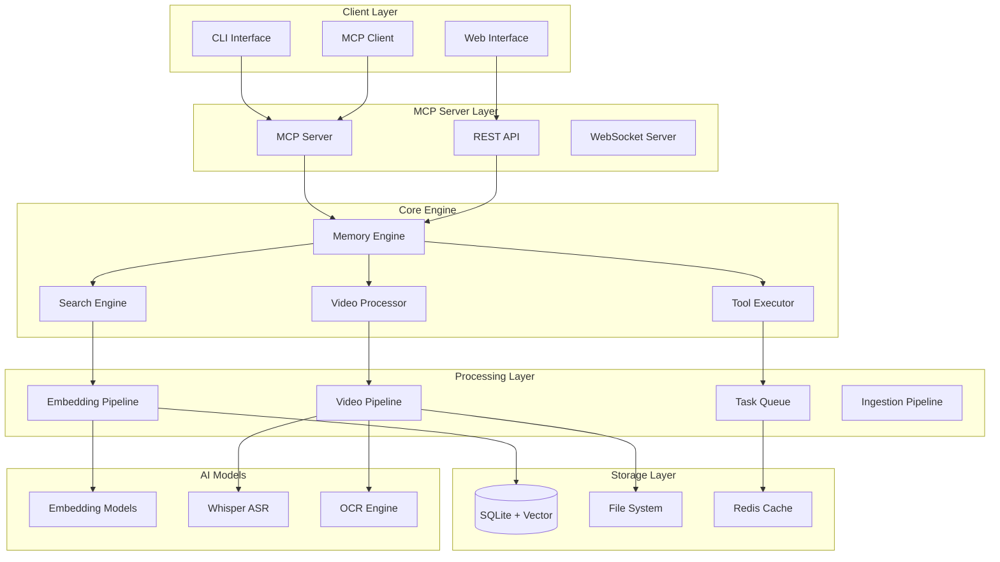
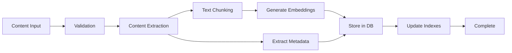
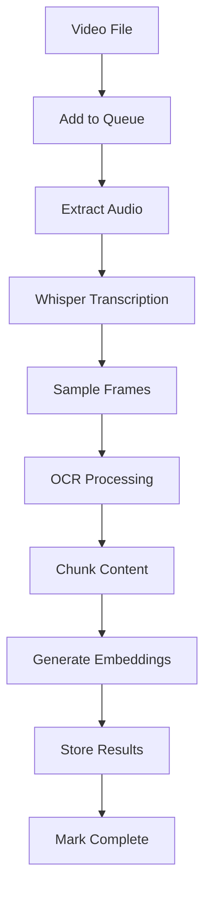

# Local Supermemory Architecture

## System Overview

A fully local, privacy-first implementation of supermemory.ai functionality with enhanced video processing capabilities and MCP server integration.



## Core Components

### 1. Memory Engine
**Purpose**: Central orchestrator for all memory operations

**Responsibilities**:
- Content ingestion and processing
- Memory retrieval and search
- Space management
- Metadata handling

```typescript
class MemoryEngine {
  private db: Database;
  private vectorStore: VectorStore;
  private searchEngine: SearchEngine;
  private videoProcessor: VideoProcessor;
  
  async addContent(content: ContentInput): Promise<string>
  async searchMemories(query: SearchQuery): Promise<SearchResult[]>
  async getMemory(id: string): Promise<Memory>
  async deleteMemory(id: string): Promise<void>
  async createSpace(space: SpaceConfig): Promise<string>
}
```

### 2. Search Engine
**Purpose**: Advanced semantic and hybrid search capabilities

**Features**:
- Vector similarity search
- Keyword search
- Hybrid search combining both
- Temporal filtering
- Multi-modal search (text + video)

```typescript
class SearchEngine {
  private vectorStore: VectorStore;
  private textIndex: TextIndex;
  
  async semanticSearch(query: string, options: SearchOptions): Promise<SearchResult[]>
  async keywordSearch(query: string, options: SearchOptions): Promise<SearchResult[]>
  async hybridSearch(query: string, options: SearchOptions): Promise<SearchResult[]>
  async videoSearch(query: string, options: VideoSearchOptions): Promise<VideoSearchResult[]>
}
```

### 3. Video Processor
**Purpose**: Complete video ingestion and processing pipeline

**Capabilities**:
- Multi-format video support
- Audio extraction and transcription
- Frame sampling and analysis
- OCR on video frames
- Speaker diarization
- Scene detection

```typescript
class VideoProcessor {
  private transcriptionEngine: WhisperEngine;
  private frameExtractor: FrameExtractor;
  private ocrEngine: OCREngine;
  
  async processVideo(videoPath: string, options: ProcessingOptions): Promise<ProcessingResult>
  async getTranscript(videoId: string): Promise<Transcript>
  async searchVideoContent(query: string, videoId?: string): Promise<VideoMatch[]>
  async extractSegment(videoId: string, start: number, end: number): Promise<VideoSegment>
}
```

### 4. Tool Executor
**Purpose**: Execute code and tools against stored memory content

**Features**:
- Python/JavaScript code execution
- SQL query execution
- Data analysis tools
- Content manipulation
- Batch operations

```typescript
class ToolExecutor {
  private sandbox: CodeSandbox;
  private sqlEngine: SQLEngine;
  
  async executeCode(code: string, language: string, context: MemoryContext): Promise<ExecutionResult>
  async executeSQLQuery(query: string, memoryIds: string[]): Promise<QueryResult>
  async analyzeContent(analysisType: string, filters: AnalysisFilters): Promise<AnalysisResult>
}
```

## Data Architecture

### Database Schema

#### Core Tables
```sql
-- Spaces for organizing memories
CREATE TABLE spaces (
    id TEXT PRIMARY KEY,
    name TEXT NOT NULL UNIQUE,
    description TEXT,
    settings JSON,
    created_at DATETIME DEFAULT CURRENT_TIMESTAMP
);

-- Main memories table
CREATE TABLE memories (
    id TEXT PRIMARY KEY,
    space_id TEXT REFERENCES spaces(id),
    content_type TEXT NOT NULL, -- 'text', 'video', 'url', 'document'
    title TEXT,
    content TEXT,
    source TEXT,
    file_path TEXT,
    metadata JSON,
    created_at DATETIME DEFAULT CURRENT_TIMESTAMP,
    updated_at DATETIME DEFAULT CURRENT_TIMESTAMP
);

-- Content chunks for better retrieval
CREATE TABLE chunks (
    id TEXT PRIMARY KEY,
    memory_id TEXT REFERENCES memories(id),
    chunk_text TEXT NOT NULL,
    chunk_order INTEGER,
    start_offset INTEGER,
    end_offset INTEGER,
    metadata JSON,
    created_at DATETIME DEFAULT CURRENT_TIMESTAMP
);

-- Vector embeddings (using sqlite-vss)
CREATE VIRTUAL TABLE embeddings USING vss0(
    chunk_id TEXT PRIMARY KEY,
    embedding(768) -- dimension depends on model
);

-- Video-specific tables
CREATE TABLE videos (
    id TEXT PRIMARY KEY,
    memory_id TEXT REFERENCES memories(id),
    file_path TEXT NOT NULL,
    duration REAL,
    resolution TEXT,
    fps REAL,
    file_size INTEGER,
    mime_type TEXT,
    processed_at DATETIME,
    processing_status TEXT DEFAULT 'pending'
);

CREATE TABLE transcripts (
    id TEXT PRIMARY KEY,
    video_id TEXT REFERENCES videos(id),
    full_text TEXT,
    language TEXT,
    confidence REAL,
    segments JSON -- array of {start, end, text, confidence}
);

CREATE TABLE video_frames (
    id TEXT PRIMARY KEY,
    video_id TEXT REFERENCES videos(id),
    timestamp REAL,
    frame_path TEXT,
    ocr_text TEXT,
    scene_change BOOLEAN DEFAULT FALSE,
    objects_detected JSON
);

-- Tags and relationships
CREATE TABLE tags (
    id TEXT PRIMARY KEY,
    name TEXT NOT NULL UNIQUE,
    color TEXT,
    created_at DATETIME DEFAULT CURRENT_TIMESTAMP
);

CREATE TABLE memory_tags (
    memory_id TEXT REFERENCES memories(id),
    tag_id TEXT REFERENCES tags(id),
    PRIMARY KEY (memory_id, tag_id)
);

-- Processing jobs queue
CREATE TABLE processing_jobs (
    id TEXT PRIMARY KEY,
    job_type TEXT NOT NULL, -- 'video', 'document', 'embedding'
    status TEXT DEFAULT 'pending', -- 'pending', 'processing', 'completed', 'failed'
    input_path TEXT,
    progress REAL DEFAULT 0,
    error_message TEXT,
    created_at DATETIME DEFAULT CURRENT_TIMESTAMP,
    started_at DATETIME,
    completed_at DATETIME
);
```

### Vector Storage Strategy

#### Embedding Models
- **Primary**: `all-MiniLM-L6-v2` (384 dimensions, fast, good quality)
- **Alternative**: `all-mpnet-base-v2` (768 dimensions, higher quality)
- **Multilingual**: `paraphrase-multilingual-MiniLM-L12-v2`

#### Storage Optimization
```typescript
interface EmbeddingStorage {
  // Compressed embeddings for space efficiency
  compressEmbeddings: boolean;
  
  // Quantization for faster search
  quantization: 'none' | 'int8' | 'binary';
  
  // Index configuration
  indexType: 'flat' | 'ivf' | 'hnsw';
  
  // Batch processing
  batchSize: number;
}
```

## Processing Pipelines

### Content Ingestion Pipeline


### Video Processing Pipeline


### Search Pipeline


## API Design

### REST API Endpoints
```
POST   /api/v1/memories              # Add content
GET    /api/v1/memories              # List memories
GET    /api/v1/memories/:id          # Get specific memory
PUT    /api/v1/memories/:id          # Update memory
DELETE /api/v1/memories/:id          # Delete memory

POST   /api/v1/search               # Search memories
POST   /api/v1/search/semantic      # Semantic search
POST   /api/v1/search/video         # Video content search

POST   /api/v1/videos/ingest        # Ingest video
GET    /api/v1/videos/:id           # Get video info
GET    /api/v1/videos/:id/transcript # Get transcript
GET    /api/v1/videos/:id/segment   # Get video segment

GET    /api/v1/spaces               # List spaces
POST   /api/v1/spaces               # Create space
PUT    /api/v1/spaces/:id           # Update space
DELETE /api/v1/spaces/:id           # Delete space

GET    /api/v1/jobs                 # List processing jobs
GET    /api/v1/jobs/:id             # Get job status

POST   /api/v1/tools/execute        # Execute tool
GET    /api/v1/analytics            # Get analytics
POST   /api/v1/export              # Export data
```

### WebSocket Events
```typescript
// Real-time updates
interface WebSocketEvents {
  'processing.started': { jobId: string; type: string };
  'processing.progress': { jobId: string; progress: number };
  'processing.completed': { jobId: string; result: any };
  'processing.failed': { jobId: string; error: string };
  
  'memory.added': { memoryId: string; spaceId: string };
  'memory.updated': { memoryId: string };
  'memory.deleted': { memoryId: string };
  
  'search.results': { queryId: string; results: SearchResult[] };
}
```

## Configuration Management

### Main Configuration
```yaml
# config.yaml
database:
  path: "./data/supermemory.db"
  vectorStore: "sqlite-vss"
  backup:
    enabled: true
    interval: "24h"
    retention: "30d"

video:
  processing:
    maxConcurrent: 2
    maxFileSize: "2GB"
    tempDir: "./tmp"
  whisper:
    model: "base"
    device: "cpu"
    language: "auto"
  frames:
    extractionInterval: 30
    format: "jpg"
    quality: 85

embeddings:
  model: "all-MiniLM-L6-v2"
  dimensions: 384
  device: "cpu"
  batchSize: 32

server:
  mcp:
    enabled: true
    name: "supermemory-local"
  rest:
    enabled: true
    port: 8080
    host: "localhost"
  websocket:
    enabled: true
    port: 8081

storage:
  maxMemoryMB: 1024
  cacheSize: 100
  tempRetention: "7d"
  
security:
  encryptionAtRest: false
  allowedOrigins: ["http://localhost:3000"]
  rateLimit:
    enabled: true
    requests: 100
    window: "1m"
```

## Performance Optimization

### Caching Strategy
```typescript
interface CacheConfiguration {
  levels: {
    l1: 'memory';     // Hot data (recent searches, embeddings)
    l2: 'disk';       // Warm data (processed content)
    l3: 'database';   // Cold data (full content)
  };
  
  policies: {
    embeddings: 'LRU';
    searchResults: 'TTL';
    videoFrames: 'LFU';
  };
  
  sizes: {
    memoryCache: '256MB';
    diskCache: '1GB';
  };
}
```

### Indexing Strategy
```sql
-- Performance indexes
CREATE INDEX idx_memories_space_created ON memories(space_id, created_at DESC);
CREATE INDEX idx_memories_content_type ON memories(content_type);
CREATE INDEX idx_chunks_memory_order ON chunks(memory_id, chunk_order);
CREATE INDEX idx_videos_processing_status ON videos(processing_status);
CREATE INDEX idx_transcripts_video ON transcripts(video_id);

-- Full-text search indexes
CREATE VIRTUAL TABLE memories_fts USING fts5(
    content, title, 
    content_rowid UNINDEXED
);

CREATE VIRTUAL TABLE chunks_fts USING fts5(
    chunk_text,
    content_rowid UNINDEXED
);
```

## Deployment Architecture

### Local Development
```bash
# Development setup
npm install
npm run build
npm run dev

# Database setup
npm run db:migrate
npm run db:seed

# Start services
npm run start:mcp     # MCP server
npm run start:api     # REST API
npm run start:worker  # Background processor
```

### Production Deployment
```dockerfile
# Dockerfile
FROM node:18-alpine

RUN apk add --no-cache \
    ffmpeg \
    python3 \
    py3-pip

WORKDIR /app
COPY package*.json ./
RUN npm ci --only=production

COPY . .
RUN npm run build

EXPOSE 8080 8081

CMD ["npm", "run", "start:all"]
```

### Docker Compose
```yaml
version: '3.8'
services:
  supermemory:
    build: .
    ports:
      - "8080:8080"
      - "8081:8081"
    volumes:
      - ./data:/app/data
      - ./config.yaml:/app/config.yaml
    environment:
      - NODE_ENV=production
      - CONFIG_PATH=/app/config.yaml
```

## Security & Privacy

### Data Privacy
- All processing happens locally
- No external API calls for core functionality
- Optional encryption at rest
- Configurable data retention policies

### Access Control
```typescript
interface SecurityConfig {
  authentication: {
    enabled: boolean;
    method: 'none' | 'token' | 'session';
  };
  
  authorization: {
    spaces: {
      [spaceId: string]: {
        read: string[];
        write: string[];
        admin: string[];
      };
    };
  };
  
  encryption: {
    atRest: boolean;
    algorithm: 'aes-256-gcm';
    keyRotation: string;
  };
}
```

## Monitoring & Analytics

### System Metrics
- Memory usage
- Processing queue length
- Search latency
- Storage usage
- Error rates

### Usage Analytics
- Search query patterns
- Content ingestion rates
- Popular content types
- User interaction patterns

### Health Checks
```typescript
interface HealthCheck {
  database: 'healthy' | 'degraded' | 'down';
  vectorStore: 'healthy' | 'degraded' | 'down';
  processing: 'healthy' | 'degraded' | 'down';
  storage: {
    usage: number;
    available: number;
    status: 'healthy' | 'warning' | 'critical';
  };
}
```

## Extensibility

### Plugin Architecture
```typescript
interface Plugin {
  name: string;
  version: string;
  
  contentProcessors?: ContentProcessor[];
  searchProviders?: SearchProvider[];
  embeddingModels?: EmbeddingModel[];
  tools?: Tool[];
}
```

### Custom Tools
```typescript
interface CustomTool {
  name: string;
  description: string;
  inputSchema: JSONSchema;
  execute: (args: any, context: MemoryContext) => Promise<ToolResult>;
}
```

This architecture provides a comprehensive, local-first alternative to supermemory.ai with enhanced video capabilities and MCP integration.