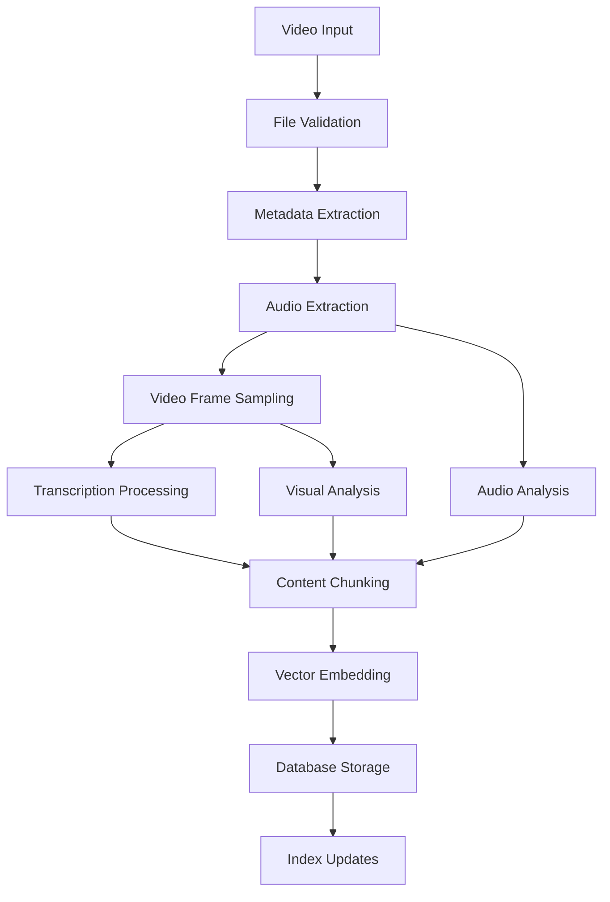

# Video Ingestion & Processing Pipeline

## Pipeline Overview



## Core Components

### 1. Video Input Handler
```typescript
interface VideoInput {
  filePath: string;
  mimeType: string;
  fileSize: number;
  duration?: number;
  title?: string;
  metadata?: Record<string, any>;
}
```

### 2. File Validation & Preprocessing
- **Supported Formats**: MP4, AVI, MOV, MKV, WebM
- **Size Limits**: Configurable (default: 2GB)
- **Duration Limits**: Configurable (default: 4 hours)
- **Quality Analysis**: Resolution, bitrate, codec detection

### 3. Metadata Extraction
```bash
# Using ffprobe for metadata
ffprobe -v quiet -print_format json -show_format -show_streams input.mp4
```

**Extracted Metadata**:
- Duration, resolution, frame rate
- Audio channels, sample rate
- Creation date, modification date
- Embedded metadata (title, description, tags)

### 4. Audio Processing Pipeline

#### Audio Extraction
```bash
# Extract audio track
ffmpeg -i input.mp4 -vn -acodec pcm_s16le -ar 16000 -ac 1 audio.wav
```

#### Transcription with Whisper
```python
import whisper

model = whisper.load_model("base")  # or "small", "medium", "large"
result = model.transcribe("audio.wav", word_timestamps=True)

# Output format:
{
  "text": "Full transcription text",
  "segments": [
    {
      "start": 0.0,
      "end": 5.2, 
      "text": "Hello world",
      "words": [
        {"word": "Hello", "start": 0.0, "end": 0.5},
        {"word": "world", "start": 0.6, "end": 1.0}
      ]
    }
  ]
}
```

#### Speaker Diarization (Optional)
```python
# Using pyannote.audio for speaker separation
from pyannote.audio import Pipeline

pipeline = Pipeline.from_pretrained("pyannote/speaker-diarization")
diarization = pipeline("audio.wav")

# Combine with transcription for speaker-labeled segments
```

### 5. Visual Processing Pipeline

#### Frame Sampling Strategy
```python
# Sample frames at regular intervals
import cv2

def sample_frames(video_path, interval_seconds=30):
    cap = cv2.VideoCapture(video_path)
    fps = cap.get(cv2.CAP_PROP_FPS)
    frame_interval = int(fps * interval_seconds)
    
    frames = []
    frame_count = 0
    
    while True:
        ret, frame = cap.read()
        if not ret:
            break
            
        if frame_count % frame_interval == 0:
            timestamp = frame_count / fps
            frames.append({
                'frame': frame,
                'timestamp': timestamp
            })
        
        frame_count += 1
    
    return frames
```

#### Visual Feature Extraction
- **Scene Detection**: Detect scene changes for better sampling
- **OCR**: Extract text from video frames using Tesseract
- **Object Detection**: Identify objects/people in frames (optional)
- **Visual Embeddings**: Generate embeddings for visual search

### 6. Content Chunking Strategy

#### Transcript Chunking
```python
def chunk_transcript(segments, max_chunk_size=500):
    chunks = []
    current_chunk = {
        'text': '',
        'start_time': None,
        'end_time': None,
        'segments': []
    }
    
    for segment in segments:
        if len(current_chunk['text']) + len(segment['text']) > max_chunk_size:
            if current_chunk['text']:
                chunks.append(current_chunk)
            current_chunk = {
                'text': segment['text'],
                'start_time': segment['start'],
                'end_time': segment['end'],
                'segments': [segment]
            }
        else:
            if current_chunk['start_time'] is None:
                current_chunk['start_time'] = segment['start']
            current_chunk['end_time'] = segment['end']
            current_chunk['text'] += ' ' + segment['text']
            current_chunk['segments'].append(segment)
    
    if current_chunk['text']:
        chunks.append(current_chunk)
    
    return chunks
```

#### Multimodal Chunking
- Align transcript chunks with visual frames
- Create multimodal embeddings combining text + visual
- Maintain temporal relationships

### 7. Vector Embedding Generation

#### Text Embeddings
```python
from sentence_transformers import SentenceTransformer

model = SentenceTransformer('all-MiniLM-L6-v2')

def generate_text_embeddings(chunks):
    embeddings = []
    for chunk in chunks:
        embedding = model.encode(chunk['text'])
        embeddings.append({
            'chunk_id': chunk['id'],
            'embedding': embedding.tolist(),
            'text': chunk['text'],
            'start_time': chunk['start_time'],
            'end_time': chunk['end_time']
        })
    return embeddings
```

#### Visual Embeddings (Optional)
```python
# Using CLIP for visual embeddings
import clip
import torch

device = "cuda" if torch.cuda.is_available() else "cpu"
model, preprocess = clip.load("ViT-B/32", device=device)

def generate_visual_embeddings(frames):
    embeddings = []
    for frame_data in frames:
        image = preprocess(frame_data['frame']).unsqueeze(0).to(device)
        with torch.no_grad():
            embedding = model.encode_image(image)
        embeddings.append({
            'timestamp': frame_data['timestamp'],
            'embedding': embedding.cpu().numpy().tolist()
        })
    return embeddings
```

## Database Schema

### Videos Table
```sql
CREATE TABLE videos (
    id TEXT PRIMARY KEY,
    file_path TEXT NOT NULL,
    title TEXT,
    duration REAL,
    file_size INTEGER,
    mime_type TEXT,
    resolution TEXT,
    fps REAL,
    created_at DATETIME DEFAULT CURRENT_TIMESTAMP,
    processed_at DATETIME,
    metadata JSON
);
```

### Transcripts Table
```sql
CREATE TABLE transcripts (
    id TEXT PRIMARY KEY,
    video_id TEXT REFERENCES videos(id),
    full_text TEXT,
    language TEXT,
    confidence REAL,
    segments JSON,
    created_at DATETIME DEFAULT CURRENT_TIMESTAMP
);
```

### Chunks Table
```sql
CREATE TABLE chunks (
    id TEXT PRIMARY KEY,
    video_id TEXT REFERENCES videos(id),
    chunk_text TEXT,
    start_time REAL,
    end_time REAL,
    chunk_type TEXT, -- 'transcript', 'visual', 'multimodal'
    embedding BLOB, -- Vector embedding
    metadata JSON,
    created_at DATETIME DEFAULT CURRENT_TIMESTAMP
);
```

### Frames Table
```sql
CREATE TABLE frames (
    id TEXT PRIMARY KEY,
    video_id TEXT REFERENCES videos(id),
    timestamp REAL,
    frame_path TEXT,
    ocr_text TEXT,
    visual_embedding BLOB,
    objects_detected JSON,
    created_at DATETIME DEFAULT CURRENT_TIMESTAMP
);
```

## Processing Queue System

### Queue Implementation
```typescript
interface ProcessingJob {
  id: string;
  videoPath: string;
  priority: 'low' | 'medium' | 'high';
  status: 'pending' | 'processing' | 'completed' | 'failed';
  progress: number;
  createdAt: Date;
  startedAt?: Date;
  completedAt?: Date;
  error?: string;
}

class VideoProcessingQueue {
  private queue: ProcessingJob[] = [];
  private processing = new Set<string>();
  private maxConcurrent = 2; // Configurable
  
  async addJob(videoPath: string, priority: 'low' | 'medium' | 'high' = 'medium') {
    const job: ProcessingJob = {
      id: generateId(),
      videoPath,
      priority,
      status: 'pending',
      progress: 0,
      createdAt: new Date()
    };
    
    this.queue.push(job);
    this.processNext();
    return job.id;
  }
  
  private async processNext() {
    if (this.processing.size >= this.maxConcurrent) return;
    
    const job = this.getNextJob();
    if (!job) return;
    
    this.processing.add(job.id);
    job.status = 'processing';
    job.startedAt = new Date();
    
    try {
      await this.processVideo(job);
      job.status = 'completed';
      job.completedAt = new Date();
    } catch (error) {
      job.status = 'failed';
      job.error = error.message;
    } finally {
      this.processing.delete(job.id);
      this.processNext(); // Process next job
    }
  }
}
```

## Performance Optimizations

### 1. Parallel Processing
- Extract audio and sample frames simultaneously
- Process multiple video chunks in parallel
- Batch embedding generation

### 2. Caching Strategy
- Cache processed transcripts
- Store intermediate processing results
- Implement LRU cache for embeddings

### 3. Resource Management
- Monitor CPU/memory usage
- Implement processing throttling
- Queue prioritization system

### 4. Storage Optimization
- Compress embeddings before storage
- Use efficient vector storage formats
- Implement data retention policies

## Error Handling & Recovery

### Common Failure Points
1. **Corrupted Video Files**: Validation and repair attempts
2. **Transcription Failures**: Fallback to simpler models
3. **Out of Memory**: Chunk processing and memory management
4. **Network Issues**: Retry mechanisms for downloads

### Recovery Strategies
```typescript
class VideoProcessor {
  async processVideo(videoPath: string, options: ProcessingOptions) {
    const checkpoint = await this.loadCheckpoint(videoPath);
    
    try {
      if (!checkpoint.audioExtracted) {
        await this.extractAudio(videoPath);
        await this.saveCheckpoint(videoPath, { audioExtracted: true });
      }
      
      if (!checkpoint.transcribed) {
        await this.transcribeAudio(videoPath);
        await this.saveCheckpoint(videoPath, { transcribed: true });
      }
      
      // Continue with remaining steps...
      
    } catch (error) {
      await this.handleError(error, videoPath, checkpoint);
      throw error;
    }
  }
}
```

## Integration Points

### MCP Server Integration
- Expose processing status via MCP tools
- Provide search capabilities for video content
- Enable tool execution against video data

### Search Integration
- Temporal search (find content at specific times)
- Multimodal search (text + visual)
- Semantic similarity search across videos

### Analytics Integration
- Processing time metrics
- Storage usage tracking
- Search performance monitoring